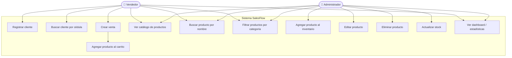
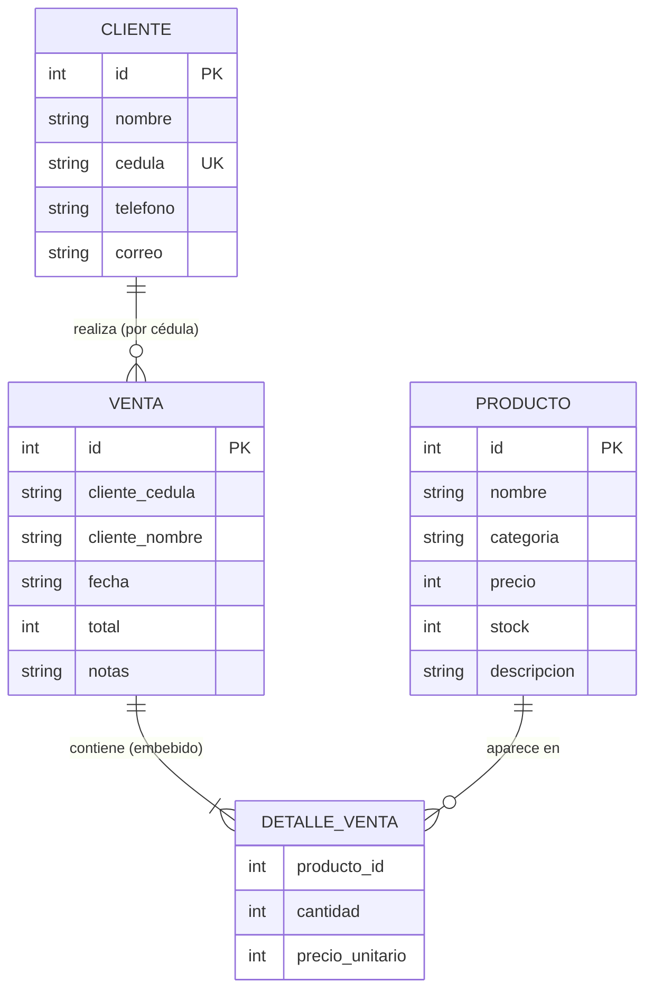
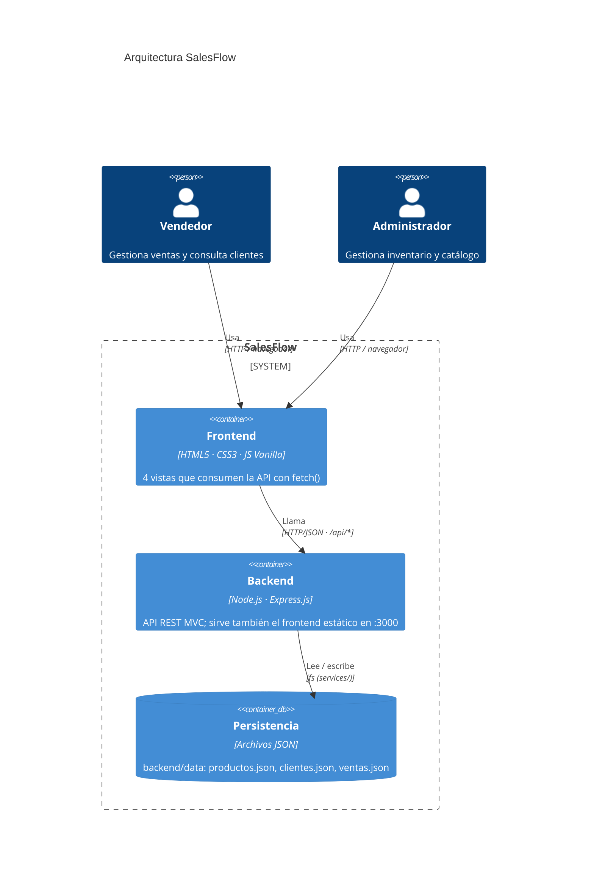
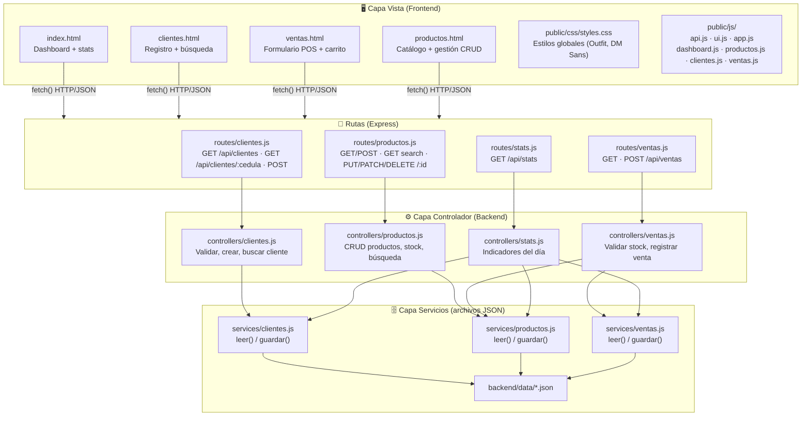
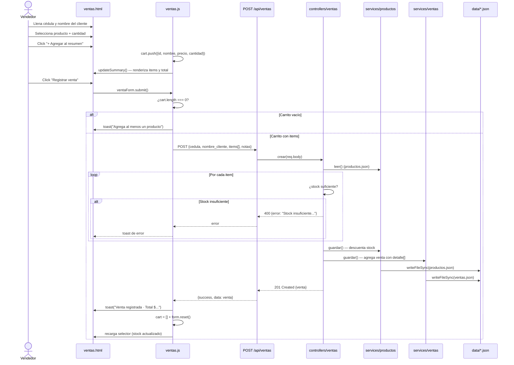
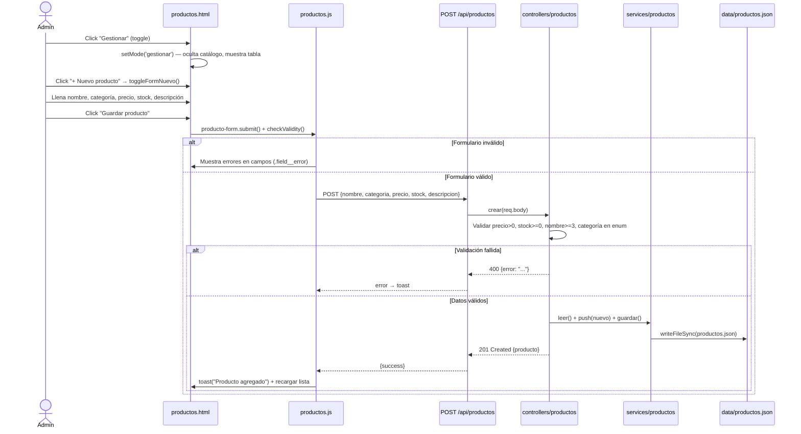
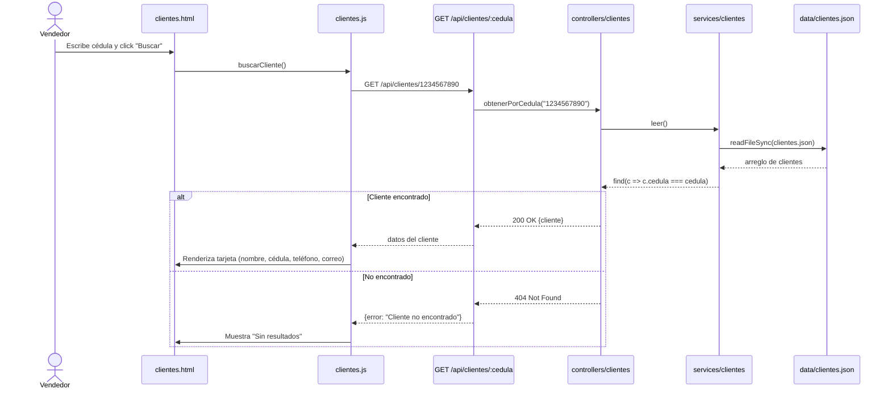
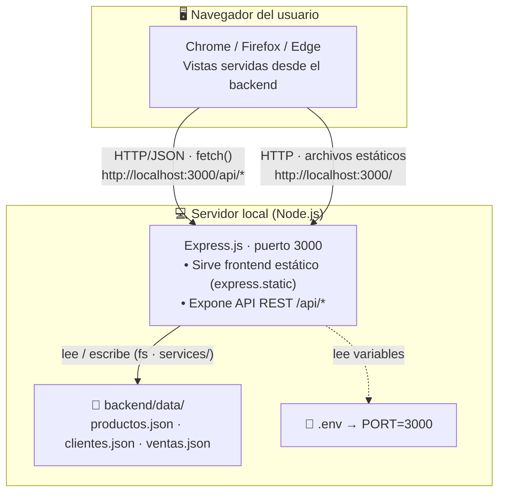
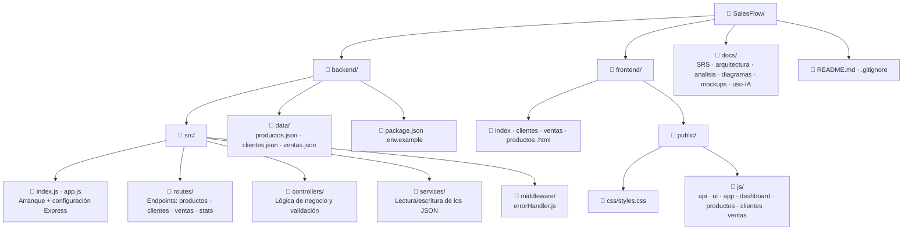

# SalesFlow — Diagramas de Arquitectura y Diseño

> Persistencia del sistema: **archivos JSON** gestionados por el backend (capa `services/`). No se usa base de datos relacional.

---

## D01. Diagrama de Casos de Uso



---

## D02. Diagrama de Flujo de Usuario / Navegación

```mermaid
flowchart TD
    START([Abrir navegador]) --> INDEX[index.html\nDashboard / Inicio]

    INDEX --> NAV_C[Ir a Clientes]
    INDEX --> NAV_V[Ir a Nueva Venta]
    INDEX --> NAV_P[Ir a Productos]

    %% Módulo Clientes
    NAV_C --> CLIENTES[clientes.html]
    CLIENTES --> FORM_C[Formulario Registrar Cliente]
    FORM_C --> VAL_C{¿Campos\nválidos?}
    VAL_C -- No --> ERR_C[Mensaje de error\nen campo]
    ERR_C --> FORM_C
    VAL_C -- Sí --> OK_C[✅ Cliente registrado\ntoast de confirmación]

    CLIENTES --> BUSCAR[Buscar por cédula]
    BUSCAR --> FOUND{¿Encontrado?}
    FOUND -- Sí --> SHOW_C[Mostrar datos del cliente]
    FOUND -- No --> NOT_FOUND[Sin resultados]

    %% Módulo Ventas
    NAV_V --> VENTAS[ventas.html]
    VENTAS --> FILL_V[Llenar datos del cliente]
    VENTAS --> SEL_P[Seleccionar producto + cantidad]
    SEL_P --> ADD_BTN[Click "+ Agregar al resumen"]
    ADD_BTN --> SUMMARY[Resumen actualizado\ntotal en tiempo real]
    SUMMARY --> MORE{¿Agregar\nmás productos?}
    MORE -- Sí --> SEL_P
    MORE -- No --> SUBMIT_V[Click "Registrar venta"]
    SUBMIT_V --> VAL_V{¿Carrito\nvacío?}
    VAL_V -- Sí --> ALERT_V[⚠️ Toast: agrega\nal menos un producto]
    ALERT_V --> SEL_P
    VAL_V -- No --> OK_V[✅ Venta registrada\nFormulario limpiado]

    %% Módulo Productos
    NAV_P --> PRODUCTOS[productos.html]
    PRODUCTOS --> TOGGLE{Modo de vista}
    TOGGLE -- Ver catálogo --> CATALOGO[Grilla de tarjetas]
    CATALOGO --> SEARCH_P[Buscar en tiempo real]
    CATALOGO --> FILTER_CAT[Filtrar por categoría]

    TOGGLE -- Gestionar --> GESTIONAR[Tabla CRUD]
    GESTIONAR --> BTN_NEW[Click "+ Nuevo producto"]
    BTN_NEW --> FORM_P[Formulario agregar producto]
    FORM_P --> VAL_P{¿Campos\nválidos?}
    VAL_P -- No --> ERR_P[Error en campo]
    ERR_P --> FORM_P
    VAL_P -- Sí --> OK_P[✅ Producto guardado]

    GESTIONAR --> EDIT_P[Click "Editar"]
    EDIT_P --> EDIT_FORM[Formulario edición]
    EDIT_FORM --> SAVE_P[Guardar cambios]

    GESTIONAR --> DEL_P[Click "Eliminar"]
    DEL_P --> CONFIRM_D{¿Confirmar?}
    CONFIRM_D -- Sí --> DELETED[Producto eliminado]
    CONFIRM_D -- No --> GESTIONAR
```

---

## D03. Diagrama Entidad-Relación (Modelo de Datos)

> Modelo lógico. La persistencia real es en archivos JSON; el detalle de venta se guarda **embebido** dentro de cada venta (no como tabla independiente).



**Estructura JSON usada como persistencia** (archivos en `backend/data/`):

```json
{
  "clientes": [
    {
      "id": 1,
      "nombre": "Carlos Pérez",
      "cedula": "1234567890",
      "telefono": "3001234567",
      "correo": "carlos@mail.com"
    }
  ],
  "productos": [
    {
      "id": 1,
      "nombre": "Aguardiente Antioqueño 750ml",
      "categoria": "aguardiente",
      "precio": 28000,
      "stock": 42,
      "descripcion": "Sin azúcar, botella de 750ml."
    }
  ],
  "ventas": [
    {
      "id": 1,
      "cliente_cedula": "1234567890",
      "cliente_nombre": "Carlos Pérez",
      "fecha": "2026-06-06T15:30:00.000Z",
      "total": 59500,
      "notas": "Pagó con efectivo",
      "detalle": [
        { "producto_id": 1, "cantidad": 1, "precio_unitario": 28000 },
        { "producto_id": 2, "cantidad": 9, "precio_unitario": 3500 }
      ]
    }
  ]
}
```

---

## D04. Diagrama de Arquitectura / Contenedores



---

## D05. Diagrama de Componentes / Capas



---

## D06. Diagramas de Secuencia

### D06-A: Registrar una venta



### D06-B: Agregar un producto nuevo al catálogo



### D06-C: Buscar cliente por cédula



---

## D07. Diagrama de Despliegue



**Flujo de despliegue local:**
```
git clone https://github.com/Pedrito2626/SalesFlow.git
cd SalesFlow/backend
pnpm install
pnpm dev            # servidor en http://localhost:3000 (frontend + API)
```

> Despliegue público (p. ej. Render/Railway) queda como mejora futura; no forma parte del alcance de esta entrega.

---

## D08. Diagrama de Estructura de Carpetas



**Resumen de responsabilidades por carpeta:**

| Carpeta | Responsabilidad |
|---|---|
| `backend/src/routes/` | Definición de endpoints REST con Express Router |
| `backend/src/controllers/` | Lógica de negocio: validaciones y orquestación |
| `backend/src/services/` | Lectura/escritura de los archivos JSON (capa Model) |
| `backend/src/middleware/` | Manejo centralizado de errores |
| `backend/data/` | Persistencia: archivos JSON |
| `frontend/` | Vistas HTML del frontend (las 4 páginas) |
| `frontend/public/css/` | Estilos globales compartidos por todas las vistas |
| `frontend/public/js/` | Consumo de API, navegación, render y estados de UI |
| `docs/` | SRS, arquitectura, análisis, diagramas, mockups y registro de IA |
```
